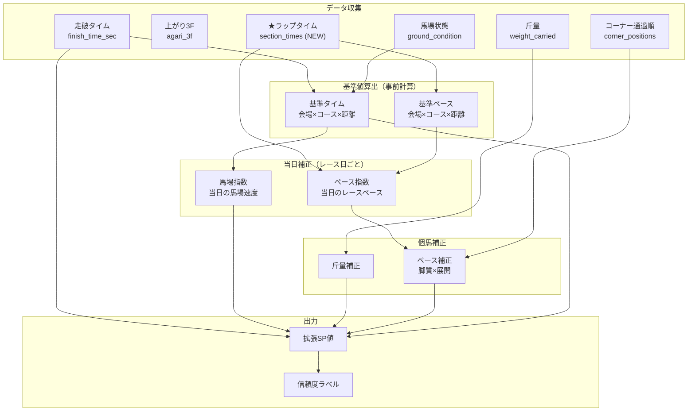

# スピード指数（SP値）システム — 完全計画書

---

## 1. 全体像



---

## 2. マスター公式

```
拡張SP値 = (基準タイム - 走破タイム) × 距離係数
         + 馬場指数
         + 斤量補正
         + ペース補正
         + ベース値(50)
```

---

## 3. 各要素の定義と算出

### 3-1. 基準タイム

**定義**: 各条件における「良馬場の勝ち馬の平均走破タイム」

**キー**: `(venue_name, course_type, distance)`

```sql
SELECT venue_name, course_type, distance,
       AVG(r.finish_time_sec)   AS base_time,
       STDDEV(r.finish_time_sec) AS std_dev,
       COUNT(*)                  AS sample_count
FROM results r
JOIN races race ON r.race_id = race.id
WHERE r.rank = 1
  AND r.finish_time_sec IS NOT NULL
  AND race.ground_condition = '良'
GROUP BY venue_name, course_type, distance
HAVING COUNT(*) >= 10;
```

> [!IMPORTANT]
> - 良馬場のみで算出（馬場差を排除した純粋な基準）
> - `sample_count < 10` の条件は近距離から線形補間
> - 路盤改修対応: 直近1年の移動平均も併用（後述）

---

### 3-2. 馬場指数

**定義**: 当日の馬場が基準より何秒速い/遅いかをレース横断で算出

```
馬場指数(日, 会場, コース) = 
    AVG(基準タイム - 当日の上位3頭平均タイム) × 距離係数
    ※当日の同会場・同コースの全レースで平均
```

```sql
-- ステップ1: 各レースの上位3頭平均タイムを算出
WITH race_top3 AS (
    SELECT r.race_id,
           race.venue_name, race.course_type, race.distance,
           race.race_date,
           AVG(r.finish_time_sec) AS top3_avg
    FROM results r
    JOIN races race ON r.race_id = race.id
    WHERE r.rank <= 3 AND r.finish_time_sec IS NOT NULL
    GROUP BY r.race_id, race.venue_name, race.course_type,
             race.distance, race.race_date
)
-- ステップ2: 基準タイムとの差を当日全レースで平均
SELECT rt.race_date, rt.venue_name, rt.course_type,
       AVG(bt.base_time - rt.top3_avg) AS track_variant
FROM race_top3 rt
JOIN base_times bt ON rt.venue_name = bt.venue_name
                   AND rt.course_type = bt.course_type
                   AND rt.distance = bt.distance
GROUP BY rt.race_date, rt.venue_name, rt.course_type;
```

**解釈**:
| track_variant | 意味 |
|---|---|
| `> 0` | 基準より速い馬場（高速馬場） |
| `= 0` | 標準的な馬場 |
| `< 0` | 基準より遅い馬場（時計がかかる） |

---

### 3-3. 距離係数

**目的**: 1秒の差が短距離ほど大きい意味を持つことを正規化

```
距離係数 = 1000 / distance × 10
```

| 距離 | 係数 | 1秒差のSP差 |
|------|------|-----------|
| 1000m | 10.0 | 10.0pt |
| 1200m | 8.33 | 8.33pt |
| 1400m | 7.14 | 7.14pt |
| 1600m | 6.25 | 6.25pt |
| 1800m | 5.56 | 5.56pt |
| 2000m | 5.00 | 5.00pt |
| 2400m | 4.17 | 4.17pt |
| 3200m | 3.13 | 3.13pt |

---

### 3-4. 斤量補正

```
斤量補正 = (57.0 - weight_carried) × 斤量係数(1.0)
```

- 55kg → `+2.0pt`（軽い分を能力に上乗せ）
- 58kg → `-1.0pt`（重い分を割引）

---

### 3-5. ペース補正（★ラップタイム活用）

#### a. ペース指数の算出

```
前半3F = section_times[0] + section_times[1] + section_times[2]
後半3F = section_times[-3] + section_times[-2] + section_times[-1]
ペース指数 = 前半3F - 後半3F
```

| ペース指数 | 判定 | 傾向 |
|-----------|------|------|
| `< -2.0` | **H（ハイ）** | 前傾ラップ → 先行馬消耗 |
| `-2.0〜+1.0` | **M（ミドル）** | 平均的ペース |
| `> +1.0` | **S（スロー）** | 後傾ラップ → 先行有利 |

#### b. ペース偏差

```
基準ペース = 同条件(会場×コース×距離)のペース指数の平均
ペース偏差 = 当日ペース指数 - 基準ペース
```

#### c. 脚質判定（corner_positionsから自動）

```python
def classify_style(corner_positions, total_horses):
    if not corner_positions or not total_horses:
        return "不明"
    ratio = corner_positions[0] / total_horses
    if ratio <= 0.2:   return "逃げ"
    if ratio <= 0.4:   return "先行"
    if ratio <= 0.7:   return "差し"
    return "追込"
```

#### d. ペース補正値

| 脚質 | 補正式 | 意味 |
|------|--------|------|
| 逃げ・先行 | `ペース偏差 × -0.5` | Hペース先行→上方修正、Sペース先行→下方修正 |
| 差し・追込 | `ペース偏差 × +0.3` | Hペース差し→やや下方修正、Sペース差し→上方修正 |

**計算例（1800m、H ペース）**:

```
前半3F=30.5, 後半3F=39.2 → ペース指数=-8.7
基準ペース(同条件)=-2.0 → ペース偏差=-6.7

馬A（1角3番手=先行）: -6.7 × -0.5 = +3.35pt ← 厳しいペースを先行した能力を評価
馬B（1角12番手=差し）: -6.7 × +0.3 = -2.01pt ← 展開利の分を割引
```

---

## 4. DBスキーマ拡張

### 新テーブル①: `race_laps`（ラップタイム）

```python
class RaceLap(Base):
    __tablename__ = "race_laps"
    id = Column(Integer, primary_key=True, autoincrement=True)
    race_id = Column(String, ForeignKey("races.id"), nullable=False, unique=True, index=True)
    section_times = Column(JSON, nullable=False)      # [7.2, 11.1, 12.2, ...]
    cumulative_times = Column(JSON, nullable=False)    # [7.2, 18.3, 30.5, ...]
    first_3f = Column(Float)                           # 前半3F（秒）
    last_3f = Column(Float)                            # 後半3F（秒）※レース全体
    pace_index = Column(Float)                         # 前半3F - 後半3F
    pace_category = Column(String)                     # 'H' / 'M' / 'S'
    race = relationship("Race", backref="laps")
```

### 新テーブル②: `base_times`（基準タイム）

```python
class BaseTime(Base):
    __tablename__ = "base_times"
    id = Column(Integer, primary_key=True, autoincrement=True)
    venue_name = Column(String, nullable=False)
    course_type = Column(String, nullable=False)
    distance = Column(Integer, nullable=False)
    base_time = Column(Float, nullable=False)          # 基準走破タイム（秒）
    base_pace = Column(Float)                          # 基準ペース指数
    sample_count = Column(Integer)                     # サンプル数
    last_updated = Column(Date)                        # 最終更新日
    __table_args__ = (UniqueConstraint(
        'venue_name', 'course_type', 'distance', name='_bt_uc'),)
```

### 新テーブル③: `speed_indices`（算出済みSP値）

```python
class SpeedIndex(Base):
    __tablename__ = "speed_indices"
    id = Column(Integer, primary_key=True, autoincrement=True)
    race_id = Column(String, ForeignKey("races.id"), nullable=False, index=True)
    horse_id = Column(String, ForeignKey("horses.id"), nullable=False, index=True)
    sp_basic = Column(Float)             # 基本SP値（ペース補正なし）
    sp_extended = Column(Float)          # 拡張SP値（ペース補正あり）
    track_variant = Column(Float)        # 適用した馬場指数
    pace_correction = Column(Float)      # 適用したペース補正
    weight_correction = Column(Float)    # 適用した斤量補正
    running_style = Column(String)       # 判定された脚質
    reliability = Column(String)         # 信頼度（A/B/C）
    __table_args__ = (UniqueConstraint(
        'race_id', 'horse_id', name='_si_uc'),)
```

---

## 5. 計算パイプライン


### Step 5: 信頼度ラベル

| ラベル | 条件 | 意味 |
|--------|------|------|
| **A** | 良馬場 & サンプル≥20 & ラップあり | 高信頼 |
| **B** | 良馬場 & サンプル≥10 & ラップなし | 中信頼（ペース補正なし） |
| **C** | 重/不良 or サンプル<10 | 参考値 |

---

## 6. 誤差修正・キャリブレーション

### 6-1. 基準タイムの移動平均更新

路盤改修や馬場傾向の変化に対応：

```sql
-- 直近1年 vs 全期間の基準タイムを比較
SELECT venue_name, course_type, distance,
    AVG(CASE WHEN race_date >= CURRENT_DATE - 365
        THEN finish_time_sec END) AS recent_base,
    AVG(finish_time_sec)          AS overall_base
FROM results r JOIN races race ON r.race_id = race.id
WHERE r.rank = 1 AND r.finish_time_sec IS NOT NULL
  AND race.ground_condition = '良'
GROUP BY venue_name, course_type, distance;
-- |recent - overall| > 0.5秒 なら recent を採用
```

### 6-2. 馬場指数の精度（上位3頭平均法）

勝ち馬1頭だけだと外れ値の影響が大きいため、上位3頭の平均を使う。
→ 3-2節のSQLで実装済み。

### 6-3. ペース係数の回帰分析による最適化

初期値（先行0.5、差し0.3）を過去データで検証・調整：

```sql
SELECT
    rl.pace_category,
    CASE
        WHEN (r.corner_positions->>0)::float / race.total_horses <= 0.4
        THEN '先行' ELSE '差し'
    END AS style,
    AVG(r.rank)   AS avg_rank,
    COUNT(*)       AS n
FROM results r
JOIN races race ON r.race_id = race.id
JOIN race_laps rl ON r.race_id = rl.race_id
WHERE r.rank IS NOT NULL AND race.total_horses > 0
GROUP BY rl.pace_category, style;
```

この結果から「Hペースで先行した馬がどれだけ沈むか」を定量化し、係数を調整。

### 6-4. 距離別・会場別の個別調整

距離が長いほどペース影響が大きい → 距離帯で係数を分ける：

| 距離帯 | 先行係数 | 差し係数 | 理由 |
|--------|---------|---------|------|
| 〜1400m | 0.3 | 0.2 | 短距離は展開差が小さい |
| 1600〜2000m | 0.5 | 0.3 | 標準 |
| 2200m〜 | 0.7 | 0.4 | 長距離はペース影響大 |

### 6-5. 馬場状態別の基準タイム

良馬場以外のレースも評価するため、馬場状態ごとの補正値を持つ：

```sql
SELECT venue_name, course_type, distance, ground_condition,
       AVG(finish_time_sec) AS avg_time
FROM results r JOIN races race ON r.race_id = race.id
WHERE r.rank = 1 AND r.finish_time_sec IS NOT NULL
GROUP BY venue_name, course_type, distance, ground_condition;
-- 良馬場との差 = 馬場状態補正値
```

---

## 7. 利用可能なDB全カラムと指数での役割

| テーブル | カラム | 指数での役割 |
|---------|--------|-------------|
| results | `finish_time_sec` | ★ SP値の主入力 |
| results | `agari_3f` | 個馬の上がり3F（脚質分析） |
| results | `corner_positions` | 脚質判定 → ペース補正の係数選択 |
| results | `weight_carried` | 斤量補正 |
| results | `horse_weight` / `horse_weight_diff` | コンディション判定 |
| results | `rank` | 基準タイム算出（勝ち馬フィルタ） |
| results | `odds` / `popularity` | 妙味度 = SP値 vs 人気の乖離 |
| results | `time_diff` | 着差分析 |
| races | `venue_name` | 基準タイムのキー |
| races | `course_type` | 基準タイムのキー（芝/ダ/障害） |
| races | `distance` | 基準タイムのキー + 距離係数 |
| races | `ground_condition` | 基準タイム算出のフィルタ + 馬場補正 |
| races | `race_date` | 馬場指数の日次グループ |
| races | `total_horses` | 脚質判定の分母 |
| horse_number_advantages | `advantage_score` | 枠番補正（既存の事前計算済み） |
| **race_laps (NEW)** | `section_times` | ペース指数算出 |
| **race_laps (NEW)** | `pace_index` | ペース補正の入力 |
| horses | `sex` / `age` | 性齢による斤量基準の調整 |
| jockeys | `id` / `name` | 騎手成績の分析 |
| trainers | `id` / `name` | 調教師成績の分析 |

---

## 8. 実装の優先順位

| 優先度 | 項目 | 依存 |
|--------|------|------|
| **P0** | `base_times` テーブル作成 + 基準タイム算出 | 既存DB |
| **P0** | 馬場指数の算出ロジック | base_times |
| **P0** | 基本SP値の算出 + `speed_indices` テーブル | 馬場指数 |
| **P1** | ラップタイムのスクレイピング + `race_laps` テーブル | パーサー拡張 |
| **P1** | ペース補正ロジック | race_laps |
| **P2** | 係数のキャリブレーション（回帰分析） | 十分なデータ蓄積後 |
| **P2** | 信頼度ラベル付与 | 全要素 |
| **P3** | フロントエンドへのSP値表示統合 | speed_indices |
